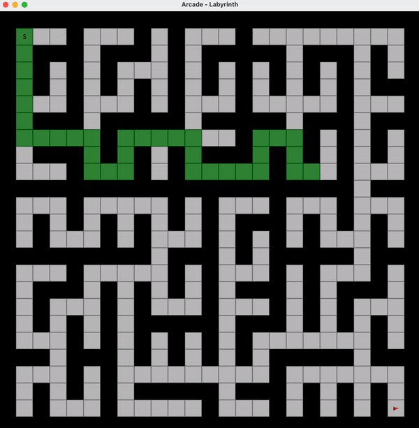

<h1 align="center">Arcade - Combinatorial optimization</h1>

<p align="center">
  <a href="https://www.java.com">
    
  </a>
  <a href="https://github.com/hexstorm9/AgeRoyale/tree/develop">
    
  </a>
    <a href="https://opensource.org/licenses/BSD-3-Clause">
    
  </a>
</p>

<p align="center">
    Arcade is a University Project for practicing combinatorial optimization. We'll find solutions for two problems: A Labyrinth and a Letter Soup.
<br>
<br>
    
</p>


## Features
- [x] Two problems to solve, Labyrinth & Letter Soup (with Graphical Interface)
- [x] Solve them with Backtracking, Branch & Bound or using a Greedy approach
- [x] Compare performance of the algorithms

## How To Use
```bash
# Clone this repository
$ git clone https://github.com/bielcarpi/CombinatorialOptimization.git

# Open the project on IntelliJ and Run it (tested with Java 17)
# On the main() there is a detailed explanation of how the program works, and what
#  attributes can be modified so as to modify its execution.
```

<br>

### Authors
Biel Carpi (biel.carpi@outlook.com)